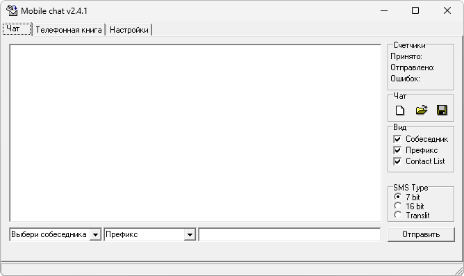

# MobileChat

**Платформы:** x35/x45/x55 (EGOLD)

MobileChat отправляет и принимает SMS через телефон Siemens и показывает переписку в виде чата. Программа ведёт список контактов, сохраняет историю, собирает длинные сообщения, выполняет транслитерацию и показывает сведения об отправке и доставке.

Версия 2.4.1 поддерживает русские записи телефонной книги; работа с C55 добавлена в версии 2.0.

## Версии

- **2.4.1** — [mobilechat-2.4.1.zip](https://git.siepatch.dev/siepatch/soft/media/branch/main/catalog/utilities/mobilechat/files/mobilechat-2.4.1.zip) (2003-08-18) Windows 32-bit · 412 КиБ
