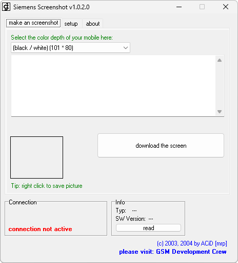

# Siemens Screenshot

**Домашняя страница:** [http://gsmdev.de/index.php?c=viewprojektinfo&id=28](https://web.archive.org/web/20050313185721/http://gsmdev.de/index.php?c=viewprojektinfo&id=28) (web archive) 
**Автор:** ACiD[mrp] 
**Платформы:** x35/x45/x55 (EGOLD)

Siemens Screenshot снимает изображение с дисплея телефона через BFB. Проверена
работа с ME45i, S55, M55 и SL55; программа также рассчитана на C45, S45, ME45,
M50, MT50, C55, A60 и C60. Поддерживаются монохромные и цветные дисплеи, включая
палитру 4096 цветов.

Для доступа к BFB некоторым прошивкам требуется
[патч OpenBFB](https://patches.kibab.com/patches/search.php5?action=search&kw=BFB);
для нескольких моделей предусмотрены готовые патчи.

## Версии

- **1.0.2.0** — [siemens-screenshot-1.0.2.0.zip](https://git.siepatch.dev/siepatch/soft/media/branch/main/catalog/utilities/siemens-screenshot/files/siemens-screenshot-1.0.2.0.zip) (2004-04-22) Windows 32-bit · 353 КиБ
