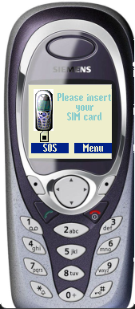

# Siemens C60

**Автор:** Siemens Mobile

Эмулятор Siemens C60 для Siemens Mobility Toolkit.

Для работы требуется [Siemens Mobility Toolkit 2.10.02][smtk].

[smtk]: /docs/soft/emulators/mobility-toolkit

## Версии

- **0.12.14** — [smtk-emulator-c60-0.12.14.zip](https://git.siepatch.dev/siepatch/soft/media/branch/main/catalog/emulators/c60/files/smtk-emulator-c60-0.12.14.zip) Windows 32-bit · 8.59 МиБ
