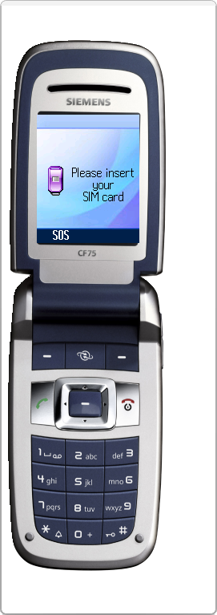

# Siemens CF75

**Автор:** Siemens Mobile

Эмулятор Siemens CF75 для Siemens Mobility Toolkit.

Для работы требуется [Siemens Mobility Toolkit 2.10.02][smtk].

[smtk]: /docs/soft/emulators/mobility-toolkit

## Версии

- **13.201.54** — [smtk-emulator-cf75-13.201.54.zip](https://git.siepatch.dev/siepatch/soft/media/branch/main/catalog/emulators/cf75/files/smtk-emulator-cf75-13.201.54.zip) Windows 32-bit · 21.8 МиБ
