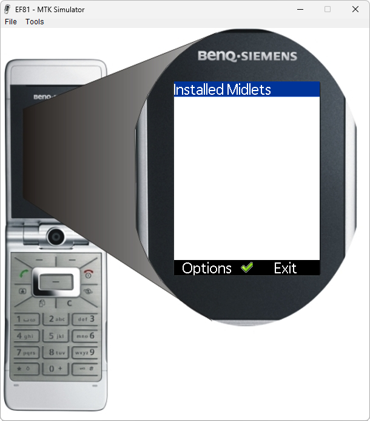

# BenQ-Siemens EF81

**Автор:** BenQ Mobile

Эмулятор BenQ-Siemens EF81 для BenQ Mobile Toolkit.

Для работы требуется [BenQ Mobile Toolkit 3.2.626][smtk].

[smtk]: /docs/soft/emulators/mobility-toolkit

## Версии

- **0.4.622** — [mtk-emulator-ef81-0.4.622.zip](https://git.siepatch.dev/siepatch/soft/media/branch/main/catalog/emulators/ef81/files/mtk-emulator-ef81-0.4.622.zip) Windows 32-bit · 9.68 МиБ
