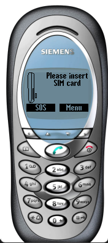

# Siemens M50

**Автор:** Siemens Mobile

Эмулятор Siemens M50 для Siemens Mobility Toolkit.

Для работы требуется [Siemens Mobility Toolkit 2.10.02][smtk].

[smtk]: /docs/soft/emulators/mobility-toolkit

## Версии

- **0.12.17** — [smtk-emulator-m50-0.12.17.zip](https://git.siepatch.dev/siepatch/soft/media/branch/main/catalog/emulators/m50/files/smtk-emulator-m50-0.12.17.zip) Windows 32-bit · 7.61 МиБ
