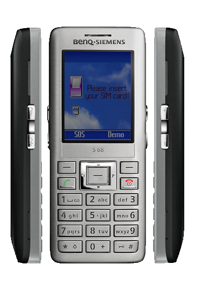

# BenQ-Siemens S68

**Автор:** BenQ Mobile

Эмулятор BenQ-Siemens S68 для BenQ Mobile Toolkit.

Для работы требуется [BenQ Mobile Toolkit 3.2.626][smtk].

[smtk]: /docs/soft/emulators/mobility-toolkit

## Версии

- **41.79.627** — [mtk-emulator-s68-41.79.627.zip](https://git.siepatch.dev/siepatch/soft/media/branch/main/catalog/emulators/s68/files/mtk-emulator-s68-41.79.627.zip) Windows 32-bit · 28.7 МиБ
