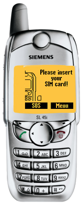

# Siemens SL45i

**Автор:** Siemens Mobile

Эмулятор Siemens SL45i для Siemens Mobility Toolkit.

Для работы требуется [Siemens Mobility Toolkit 2.10.02][smtk].

[smtk]: /docs/soft/emulators/mobility-toolkit

## Версии

- **0.12.49** — [smtk-emulator-sl45i-0.12.49.zip](https://git.siepatch.dev/siepatch/soft/media/branch/main/catalog/emulators/sl45i/files/smtk-emulator-sl45i-0.12.49.zip) Windows 32-bit · 7.15 МиБ
