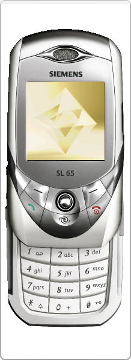

# Siemens SL65

**Автор:** Siemens Mobile

Эмулятор Siemens SL65 для Siemens Mobility Toolkit.

Для работы требуется [Siemens Mobility Toolkit 2.10.02][smtk].

[smtk]: /docs/soft/emulators/mobility-toolkit

## Версии

- **11.119.41** — [smtk-emulator-sl65-11.119.41.zip](https://git.siepatch.dev/siepatch/soft/media/branch/main/catalog/emulators/sl65/files/smtk-emulator-sl65-11.119.41.zip) Windows 32-bit · 16.6 МиБ
