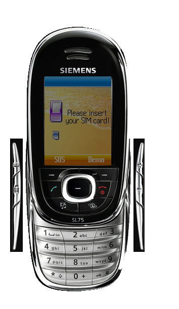

# Siemens SL75

**Автор:** Siemens AG, BenQ Mobile

Эмуляторы Siemens SL75 для BenQ Mobile Toolkit.

Для работы требуется [BenQ Mobile Toolkit 3.2.626][mtk].

[mtk]: /docs/soft/emulators/mobility-toolkit

## Версии

- **41.79.630** — [mtk-emulator-sl75-41.79.630.zip](https://git.siepatch.dev/siepatch/soft/media/branch/main/catalog/emulators/sl75/files/mtk-emulator-sl75-41.79.630.zip) Windows 32-bit · 29.8 МиБ
- **05.79.551** — [mtk-emulator-sl75-05.79.551.zip](https://git.siepatch.dev/siepatch/soft/media/branch/main/catalog/emulators/sl75/files/mtk-emulator-sl75-05.79.551.zip) Windows 32-bit · 26.5 МиБ
