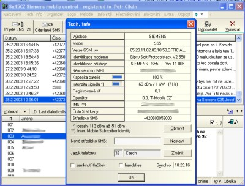

{/* Generated by tools/generateSoftware.ts. Do not edit manually. */}

# SiMoCo

**Домашняя страница:** [http://www.mysiemens.cz/ms/simoco/](https://web.archive.org/web/20070513090023/http://www.mysiemens.cz/ms/simoco/) (web archive) 
**Тема на форуме:** [https://www.siemensmania.cz/forum/viewtopic.php?t=1018](https://www.siemensmania.cz/forum/viewtopic.php?t=1018) 
**Автор:** Ing. Pavel Cibulka

SiMoCo (Siemens Mobile Control, прежнее название — Sx45CZ) предназначена для
управления мобильными телефонами Siemens с компьютера. Поддерживаются S25,
C35(i), M35, S35(i), SL42(i), SL45(i), C45, S45(i), ME45, M50, MT50, C55,
S55, SL55, M55, A60, C60, MC60, CF62, C65, M65, CX65, S65, CX70, C75, CX75,
M75 и S75. Телефон подключается кабелем к последовательному порту или через
ИК-порт, создающий виртуальный COM-порт.

Возможности программы:

- Просмотр технической информации о телефоне.
- Управление вызовами, громкостью, мелодией, вибровызовом, звуком,
  блокировкой клавиатуры и громкой связью.
- Отображение номера входящего вызова, приём и отклонение вызова.
- Просмотр и редактирование телефонных книг SIM и телефона, адресной книги,
  печать, резервное копирование и восстановление, перенос записей мышью,
  импорт и экспорт vCard.
- Создание и отправка SMS с выбором кодировки, срока действия, отчёта о
  доставке и режима Flash SMS; длинные сообщения до пяти SMS.
- Групповая отправка SMS и сохранение групп получателей.
- Просмотр и редактирование SMS на SIM-карте и в памяти телефона.
- Отправка и приём EMS: составных сообщений, изображений, анимаций и звуков,
  в том числе на телефонах без встроенной поддержки EMS.
- Автоматическое архивирование принятых и отправленных SMS, экспорт в CSV и
  сохранение текста сообщений в файл.
- Уведомления о новых SMS отдельным окном или значком в области уведомлений.
- Доступ к FlexMemory и передача файлов между телефоном и компьютером.
- Просмотр и редактирование органайзера и календаря.
- Поддержка национальных символов в SMS, телефонных книгах, адресной книге и
  органайзере с использованием UCS-2 и UTF-8.
- Просмотр доступных и предпочтительных сетей, сведений об операторах и
  редактирование списка предпочтительных сетей.
- Загрузка логотипов и заставок из BMP- и GIF-файлов, а также редактор
  логотипов.
- Загрузка мелодий из MIDI-файлов и редактор мелодий iMelody с сохранением в
  TXT, iMelody или MIDI.
- Настройка переадресации и запретов вызовов.
- Синхронизация даты и времени телефона с компьютером.
- Отправка DTMF-сигналов и строк.
- Дистанционное управление телефоном через AT+CKPD.
- Активация сервисного меню телефона.
- Просмотр обмена между программой и телефоном и ручной ввод AT-команд в
  окне терминала.

## Версии

- **2.2.9** — [SiMoCo-2.2.9.zip](https://git.siepatch.dev/siepatch/soft/media/branch/main/catalog/explorers/simoco/files/SiMoCo-2.2.9.zip) (2007-04-30) Windows 32-bit · 1.02 МиБ
