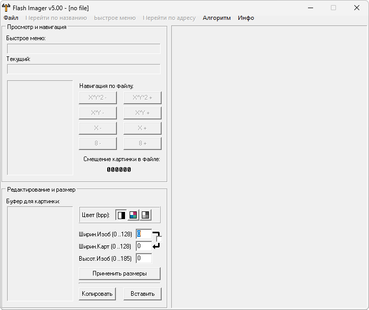

{/* Generated by tools/generateSoftware.ts. Do not edit manually. */}

# Flash Imager

**Автор:** Club SieMEns 45.55 
**Платформы:** x10/x25 (HIGOLD), x35/x45/x55 (EGOLD)

Flash Imager открывает FullFlash в формате BIN или BIF, показывает найденную
графику и позволяет заменять изображения. Поддержка моделей и расположение
картинок задаются текстовыми файлами в каталоге `menu`, поэтому набор можно
дополнять без изменения программы.

В архив входит полный комплект таблиц для разных моделей и прошивок Siemens, а
также более 40 примеров изображений.

## Версии

- **5.00** — [flash-imager-5.00.zip](https://git.siepatch.dev/siepatch/soft/media/branch/main/catalog/modding/flash-imager/files/flash-imager-5.00.zip) Windows 32-bit · 542 КиБ
