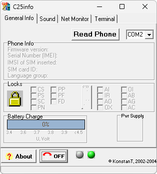

# C25info

**Платформы:** x10/x25 (HIGOLD)

C25info показывает сведения о Siemens C25 и C28: версию прошивки, IMEI, заряд аккумулятора, состояние блокировок и регистрации в сети.
Программа позволяет включить Net Monitor и полное сервисное меню, загрузить MIDI-мелодию и отправлять телефону AT-команды.

## Версии

- **1.0** — [c25info-1.0.zip](https://git.siepatch.dev/siepatch/soft/media/branch/main/catalog/service/c25info/files/c25info-1.0.zip) Windows 32-bit · 339 КиБ
