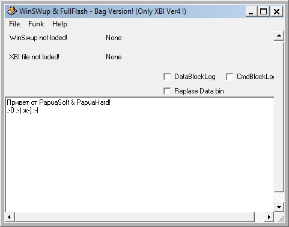

{/* Generated by tools/generateSoftware.ts. Do not edit manually. */}

# WSFF

**Домашняя страница:** [http://papuas.allsiemens.com/](https://web.archive.org/web/20130825050857/http://papuas.allsiemens.com/) (web archive) 
**Автор:** Papuas 
**Платформы:** x10/x25 (HIGOLD), x35/x45/x55 (EGOLD), x65/x75 (SGOLD), ODM, BREW

Программа для анализа и распаковки WinSwup-баз.

## Версии

- **4** — [WSFF4.zip](https://git.siepatch.dev/siepatch/soft/media/branch/main/catalog/utilities/wsff/files/WSFF4.zip) (2006-02-10) Windows 32-bit · 158 КиБ

<strong>Архивные версии (1)</strong>

- **2** — [WSFF2.zip](https://git.siepatch.dev/siepatch/soft/media/branch/main/catalog/utilities/wsff/files/WSFF2.zip) (2005-10-23) Windows 32-bit · 157 КиБ

