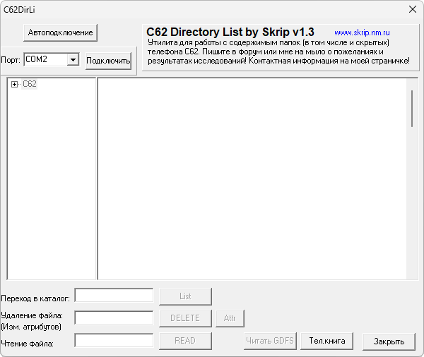

# C62DirLi

**Автор:** Skrip 
**Платформы:** ODM

C62DirLi редактирует XML-списки каталогов файловой системы Siemens C62. С их помощью можно менять атрибуты файлов и каталогов, открывать скрытые папки и разрешать чтение, запись или удаление объектов через OBEX.

Для получения и обратной записи списков используется Flash Programmer. Версия 1.3 умеет снимать атрибут «только для чтения» и при необходимости запускает `C62MdmUn.exe` для перевода телефона в сервисный режим.

## Версии

- **1.3** — [c62dirli-1.3.zip](https://git.siepatch.dev/siepatch/soft/media/branch/main/catalog/explorers/c62dirli/files/c62dirli-1.3.zip) (2005-04-14) Windows 32-bit · 334 КиБ
