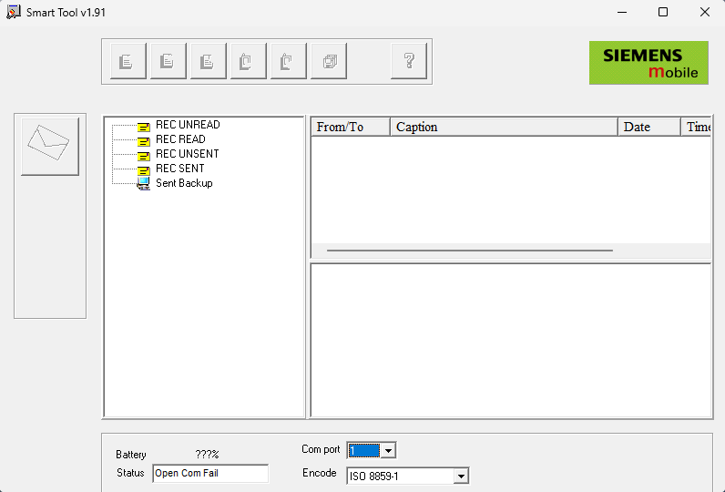

# Smart Tool

**Автор:** Siemens AG 
**Платформы:** ODM

Официальная программа Siemens для работы с телефонами ST55 и ST60 через последовательный порт. Smart Tool позволяет:

- Читать, редактировать и записывать телефонную книгу;
- Читать, архивировать, создавать и отправлять SMS;
- Копировать фотографии, логотипы, фоновые изображения, мелодии, звуковые и видеофайлы;
- Создавать мелодии во встроенном редакторе.

Поддерживается выбор кодировки телефонной книги и сообщений, включая кириллицу.

## Версии

- **1.91** — [smart-tool-1.91.zip](https://git.siepatch.dev/siepatch/soft/media/branch/main/catalog/explorers/smart-tool/files/smart-tool-1.91.zip) Windows 32-bit · 8.79 МиБ
