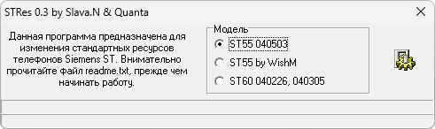

{/* Generated by tools/generateSoftware.ts. Do not edit manually. */}

# STRes

**Платформы:** ODM

STRes предназначен для изменения ресурсов телефонов Siemens ST55 и ST60.
Программа открывает полный бэкап в формате MOT, созданный Milano Backup Tool,
заменяет в нём графику по файлу ресурсов STR и сохраняет изменённый бэкап для
записи обратно в телефон.

Версия 0.3 поддерживает Siemens ST55 с прошивкой 040503 и сборкой WishM, а также
ST60 с прошивками 040226 и 040305. Для поддерживаемых прошивок предусмотрены
готовые таблицы ресурсов.

## Версии

- **0.3** — [stres-0.3.zip](https://git.siepatch.dev/siepatch/soft/media/branch/main/catalog/modding/stres/files/stres-0.3.zip) (2004-11-14) Windows 32-bit · 223 КиБ

<strong>Архивные версии (2)</strong>

- **0.2b** — [stres-0.2b.zip](https://git.siepatch.dev/siepatch/soft/media/branch/main/catalog/modding/stres/files/stres-0.2b.zip) (2004-11-10) Windows 32-bit · 198 КиБ
- **0.1** — [stres-0.1.zip](https://git.siepatch.dev/siepatch/soft/media/branch/main/catalog/modding/stres/files/stres-0.1.zip) (2004-10-17) Windows 32-bit · 193 КиБ

