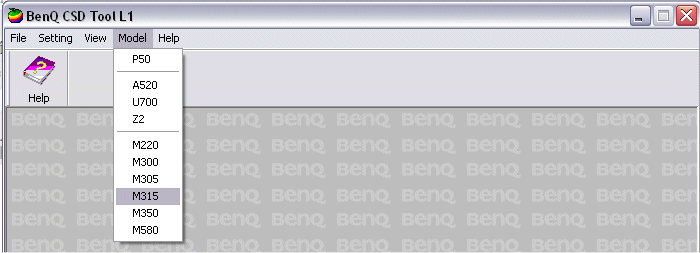

# BenQ XCSD Tool

**Автор:** BenQ Mobile 
**Платформы:** ODM

Сервисная программа для телефонов BenQ и BenQ-Siemens на платформе TI, а также P50. Загружает основную и языковую прошивки, записывает конфигурацию PPF, сохраняет и восстанавливает настройки сети, WAP и содержимое Media Center, снимает блокировки.

Версия L1 предназначена для обычного сервисного обновления. Версия L2 дополнительно записывает boot-файл при восстановлении не включающихся телефонов. Дистрибутив L2 не найден.

## Версии

- **L1 1.5.5** — [benq-xcsd-tool-l1-1.5.5.zip](https://git.siepatch.dev/siepatch/soft/media/branch/main/catalog/service/benq-xcsd-tool/files/benq-xcsd-tool-l1-1.5.5.zip) Windows 32-bit · 3.51 МиБ

## Дополнительные файлы

- [benq-xcsd-tool-l1-manual-1.3.zip](https://git.siepatch.dev/siepatch/soft/media/branch/main/catalog/service/benq-xcsd-tool/files/benq-xcsd-tool-l1-manual-1.3.zip) Сервисная документация L1 647 КиБ
- [benq-xcsd-tool-l2-manual-1.0.zip](https://git.siepatch.dev/siepatch/soft/media/branch/main/catalog/service/benq-xcsd-tool/files/benq-xcsd-tool-l2-manual-1.0.zip) Сервисная документация L2 988 КиБ
