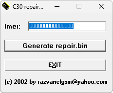

# C30 Repair BIN Generator

**Платформы:** ODM

Генератор создаёт по IMEI файл `repair.bin` для восстановления Siemens C30.

## Версии

- **1.11.0** — [c30-repair-bin-generator-1.11.0.zip](https://git.siepatch.dev/siepatch/soft/media/branch/main/catalog/service/c30-repair-bin-generator/files/c30-repair-bin-generator-1.11.0.zip) Windows 32-bit · 602 КиБ
