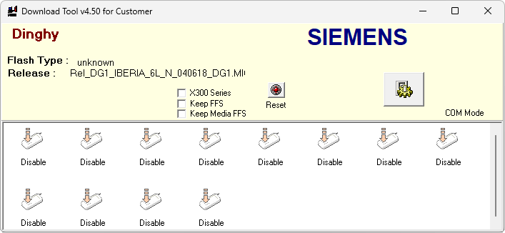

# CL50 Dinghy SW Downloader

**Автор:** Quanta Computer Inc. 
**Платформы:** ODM

Сервисный загрузчик проекта Dinghy для Siemens CL50. Основная программа, языковой пакет и mapping выбираются отдельно; поддерживаются COM- и USB-подключение, чтение flash-памяти и сохранение пользовательских областей при обновлении.

## Версии

- **1.0** — [cl50-dinghy-downloader-2004-06-18.zip](https://git.siepatch.dev/siepatch/soft/media/branch/main/catalog/service/cl50-dinghy-downloader/files/cl50-dinghy-downloader-2004-06-18.zip) (2004-06-18) Windows 32-bit · 993 КиБ
