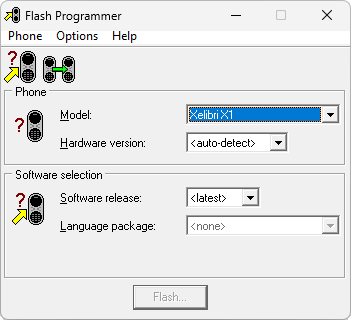

# Flash Programmer

**Автор:** Microcell Ltd 
**Платформы:** ODM

Флешер для Siemens C62. Загружает в телефон основное программное обеспечение, языковой пакет и пакет персонализации.

Версия 2.83 позволяет записывать пакеты восстановления GDFS. Для работы программе нужны отдельные файлы прошивки C62; в каталог они не входят.

## Версии

- **2.83** — [flash-programmer-2.83.zip](https://git.siepatch.dev/siepatch/soft/media/branch/main/catalog/service/flash-programmer/files/flash-programmer-2.83.zip) Windows 32-bit · 2.78 МиБ

<strong>Архивные версии (1)</strong>

- **2.78** — [flash-programmer-2.78.zip](https://git.siepatch.dev/siepatch/soft/media/branch/main/catalog/service/flash-programmer/files/flash-programmer-2.78.zip) Windows 32-bit · 2.69 МиБ

