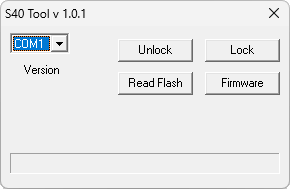

# Siemens S40 Tool

**Платформы:** ODM

Сервисная утилита для блокировки и разблокировки Siemens S40, чтения flash-памяти и записи прошивки.

## Версии

- **1.0.1** — [siemens-s40-tool-1.0.1.zip](https://git.siepatch.dev/siepatch/soft/media/branch/main/catalog/service/siemens-s40-tool/files/siemens-s40-tool-1.0.1.zip) Windows 32-bit · 13.2 КиБ
