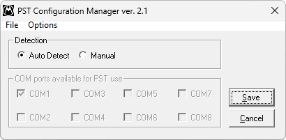

# Siemens U10/U15 Update Software

**Платформы:** ODM

Комплект Motorola PST 3G Carrier для прошивки Siemens U10 и U15.

## Версии

- **6.9.1** — [u10-u15-update-software-6.9.1.zip](https://git.siepatch.dev/siepatch/soft/media/branch/main/catalog/service/u10-u15-update-software/files/u10-u15-update-software-6.9.1.zip) Windows 32-bit · 11.1 МиБ

<strong>Архивные версии (1)</strong>

- **6.1** — [u10-u15-update-software-6.1.zip](https://git.siepatch.dev/siepatch/soft/media/branch/main/catalog/service/u10-u15-update-software/files/u10-u15-update-software-6.1.zip) Windows 32-bit · 10.5 МиБ

