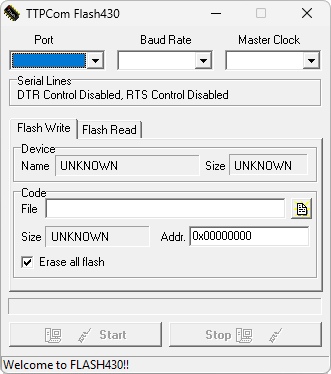

# X3 Software Update Program

**Автор:** TTPCom Limited 
**Платформы:** ODM

Сервисная программа TTPCom FLASH430 для телефонов Siemens ODM-серии. Загружает прошивки в форматах MOT, BIF и BIN, стирает flash-память, проверяет контрольную сумму и позволяет считать заданный диапазон памяти в файл.

## Версии

- **4.30** — [x3-software-update-program-4.30.zip](https://git.siepatch.dev/siepatch/soft/media/branch/main/catalog/service/x3-software-update-program/files/x3-software-update-program-4.30.zip) Windows 32-bit · 312 КиБ
