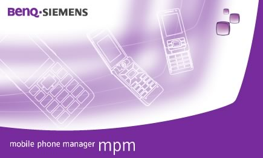

# Mobile Phone Manager (MPM)

**Автор:** BenQ Mobile GmbH & Co. OHG 
**Платформы:** x65/x75 (SGOLD)

Официальная программа для управления телефонами BenQ-Siemens. В состав входят
файловый менеджер, синхронизация контактов и календаря с Microsoft Outlook,
резервное копирование и восстановление данных, работа с сообщениями и
мультимедиа, а также Mobile Modem Assistant для подключения компьютера к
интернету через телефон.

Телефон можно подключить по USB, IrDA или Bluetooth. Эта сборка полноценно
работает с E71 и EL71.

## Версии

- **4.20.636.41.0.0** — [mobile-phone-manager-4.20.636.41.0.0.zip](https://git.siepatch.dev/siepatch/soft/media/branch/main/catalog/explorers/mobile-phone-manager/files/mobile-phone-manager-4.20.636.41.0.0.zip) Windows 32-bit · 69.3 МиБ

<strong>Архивные версии (12)</strong>

- **4.20.631.41.0.0** — [mobile-phone-manager-4.20.631.41.0.0-smartsync.zip](https://git.siepatch.dev/siepatch/soft/media/branch/main/catalog/explorers/mobile-phone-manager/files/mobile-phone-manager-4.20.631.41.0.0-smartsync.zip) Пакет SmartSync на русском языке Windows 32-bit · 68.6 МиБ
- **4.06.26.51.1.0** — [mobile-phone-manager-4.06.26.51.1.0-smartsync.zip](https://git.siepatch.dev/siepatch/soft/media/branch/main/catalog/explorers/mobile-phone-manager/files/mobile-phone-manager-4.06.26.51.1.0-smartsync.zip) Пакет SmartSync на русском языке Windows 32-bit · 67.3 МиБ
- **4.06.21.31.0.0** — [mobile-phone-manager-4.06.21.31.0.0-smartsync.zip](https://git.siepatch.dev/siepatch/soft/media/branch/main/catalog/explorers/mobile-phone-manager/files/mobile-phone-manager-4.06.21.31.0.0-smartsync.zip) Пакет SmartSync на русском языке Windows 32-bit · 67.1 МиБ
- **4.06.17.31.0.1** — [mobile-phone-manager-4.06.17.31.0.1-smartsync.zip](https://git.siepatch.dev/siepatch/soft/media/branch/main/catalog/explorers/mobile-phone-manager/files/mobile-phone-manager-4.06.17.31.0.1-smartsync.zip) Пакет SmartSync на русском языке Windows 32-bit · 67.0 МиБ
- **4.06.08.21.1.0** — [mobile-phone-manager-4.06.08.21.1.0-smartsync-en.zip](https://git.siepatch.dev/siepatch/soft/media/branch/main/catalog/explorers/mobile-phone-manager/files/mobile-phone-manager-4.06.08.21.1.0-smartsync-en.zip) Пакет SmartSync на английском языке Windows 32-bit · 67.0 МиБ
- **4.06.07.11.1.0** — [mobile-phone-manager-4.06.07.11.1.0-smartsync.zip](https://git.siepatch.dev/siepatch/soft/media/branch/main/catalog/explorers/mobile-phone-manager/files/mobile-phone-manager-4.06.07.11.1.0-smartsync.zip) Пакет SmartSync на русском языке Windows 32-bit · 66.5 МиБ
- **4.05.51.11.2.1** — [mobile-phone-manager-4.05.51.11.2.1-smartsync.zip](https://git.siepatch.dev/siepatch/soft/media/branch/main/catalog/explorers/mobile-phone-manager/files/mobile-phone-manager-4.05.51.11.2.1-smartsync.zip) Пакет SmartSync на русском языке Windows 32-bit · 66.3 МиБ
- **3.05.43.51.0.0** — [mobile-phone-manager-3.05.43.51.0.0-smartsync.zip](https://git.siepatch.dev/siepatch/soft/media/branch/main/catalog/explorers/mobile-phone-manager/files/mobile-phone-manager-3.05.43.51.0.0-smartsync.zip) Пакет SmartSync на русском языке Windows 32-bit · 53.9 МиБ
- **3.05.28.51.3.0** — [mobile-phone-manager-3.05.28.51.3.0-smartsync.zip](https://git.siepatch.dev/siepatch/soft/media/branch/main/catalog/explorers/mobile-phone-manager/files/mobile-phone-manager-3.05.28.51.3.0-smartsync.zip) Пакет SmartSync на русском языке Windows 32-bit · 53.3 МиБ
- **3.05.28.51.2.0** — [mobile-phone-manager-3.05.28.51.2.0.zip](https://git.siepatch.dev/siepatch/soft/media/branch/main/catalog/explorers/mobile-phone-manager/files/mobile-phone-manager-3.05.28.51.2.0.zip) Windows 32-bit · 38.5 МиБ
- **3.04.40.48.4** — [mobile-phone-manager-3.04.40.48.4-phoneexplorer.zip](https://git.siepatch.dev/siepatch/soft/media/branch/main/catalog/explorers/mobile-phone-manager/files/mobile-phone-manager-3.04.40.48.4-phoneexplorer.zip) Пакет Phone Explorer Windows 32-bit · 22.0 МиБ
- **3.04.40.43** — [mobile-phone-manager-3.04.40.43.zip](https://git.siepatch.dev/siepatch/soft/media/branch/main/catalog/explorers/mobile-phone-manager/files/mobile-phone-manager-3.04.40.43.zip) Windows 32-bit · 33.3 МиБ
- **3.04.40.43** — [mobile-phone-manager-3.04.40.43-smartsync.zip](https://git.siepatch.dev/siepatch/soft/media/branch/main/catalog/explorers/mobile-phone-manager/files/mobile-phone-manager-3.04.40.43-smartsync.zip) Пакет SmartSync на русском языке Windows 32-bit · 46.9 МиБ

