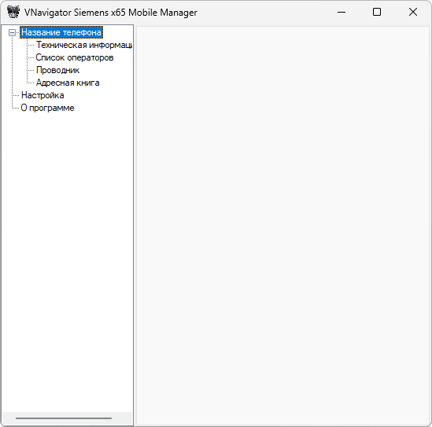

{/* Generated by tools/generateSoftware.ts. Do not edit manually. */}

# VNavigator x65 (OLD)

**Домашняя страница:** [http://www.vnavigator.com.ru/](https://web.archive.org/web/20050319154203/http://www.vnavigator.com.ru/) (web archive) 
**Автор:** VNavigator Soft 
**Платформы:** x65/x75 (SGOLD)

Программа для работы с файловой системой телефонов Siemens x65. Файлы и папки
можно копировать, перемещать, переименовывать и удалять, а также изменять их
атрибуты и просматривать свободное место на дисках телефона.

Для подключения через самодельные и нефирменные кабели предусмотрен встроенный
AT Enabler.

## Версии

- **1.0.1.34b** — [vnavigator-1.0.1.34b.zip](https://git.siepatch.dev/siepatch/soft/media/branch/main/catalog/explorers/vnavigator/files/vnavigator-1.0.1.34b.zip) (2005-03-03) Windows 32-bit · 833 КиБ
