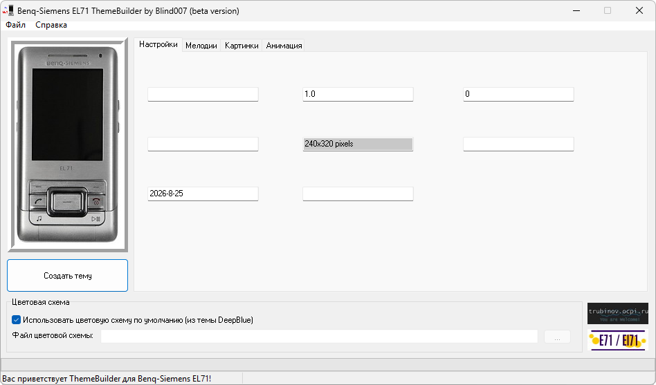

# BenQ-Siemens EL71 ThemeBuilder

**Домашняя страница:** [http://trubinov.ocpi.ru/](https://web.archive.org/web/20070909015533/http://trubinov.ocpi.ru/) (web archive) 
**Тема на форуме:** [http://e71.ru/forum/20-79-1](http://e71.ru/forum/20-79-1) 
**Автор:** Blind007 
**Платформы:** x65/x75 (SGOLD)

Программа собирает темы оформления для BenQ-Siemens E71 и EL71. В тему можно
добавить мелодии звонка, сообщений, включения и выключения, анимацию,
скринсейвер, фоновый рисунок, элементы меню, строки состояния, бордюры и другие
графические ресурсы.

В версии 1.0.3.0 добавлены предварительный просмотр на дисплее телефона и
ведение лог-файлов. Открытие и редактирование уже собранных тем не реализовано.

## Версии

- **1.0.3.0** — [benq-siemens-el71-theme-builder-1.0.3.0.zip](https://git.siepatch.dev/siepatch/soft/media/branch/main/catalog/modding/benq-siemens-el71-theme-builder/files/benq-siemens-el71-theme-builder-1.0.3.0.zip) (2007-07-30) Windows 32-bit · 400 КиБ
