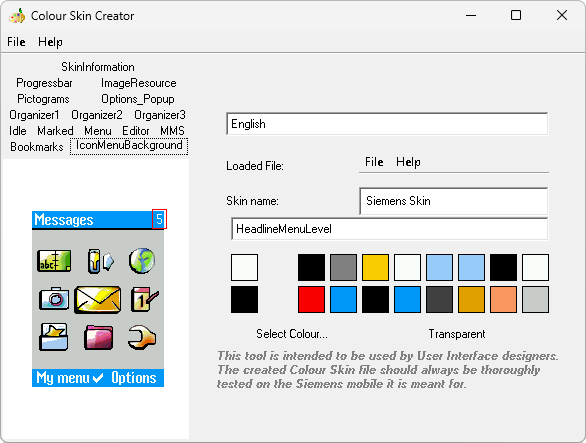

# Colour Skin Creator

**Автор:** Siemens 
**Платформы:** x65/x75 (SGOLD)

Официальная программа Siemens из набора Siemens Customization Tools для
создания цветовых схем телефонов x65.

В интерактивном окне предпросмотра можно настроить цвета фона, текста,
выделенных элементов и других частей интерфейса телефона. Цвет выбирается из
палитры или задаётся в HSB/RGB; поддерживается прозрачность. Готовая схема
сохраняется в формате SCS для загрузки в папку цветовых схем телефона.

## Версии

- **1.0** — [colour-skin-creator-1.0.zip](https://git.siepatch.dev/siepatch/soft/media/branch/main/catalog/modding/colour-skin-creator/files/colour-skin-creator-1.0.zip) (2004-09-01) Требуется Java Runtime Environment Windows 32-bit · 638 КиБ
