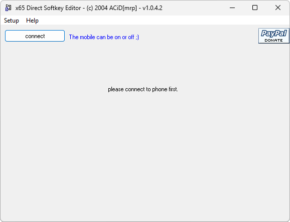

{/* Generated by tools/generateSoftware.ts. Do not edit manually. */}

# x65 Direct Softkey Editor

**Домашняя страница:** [http://www.gsmdev.de/](https://web.archive.org/web/20041126044722/http://www.gsmdev.de/) (web archive) 
**Автор:** ACiD[mrp] 
**Платформы:** x65/x75 (SGOLD)

Direct Softkey Editor позволяет изменить все софт-клавиши и ярлыки в любом
телефоне Siemens x65, в том числе те, которые штатное меню предлагает назначить
только один раз.

Программа переводит телефон в сервисный режим, считывает назначения клавиш и
список «Моё меню», позволяет выбрать новые значения и записывает изменения
обратно в телефон.

## Версии

- **1.0.4.2** — [direct-softkey-editor-1.0.4.2.zip](https://git.siepatch.dev/siepatch/soft/media/branch/main/catalog/modding/direct-softkey-editor/files/direct-softkey-editor-1.0.4.2.zip) (2004-10-18) Windows 32-bit · 418 КиБ
