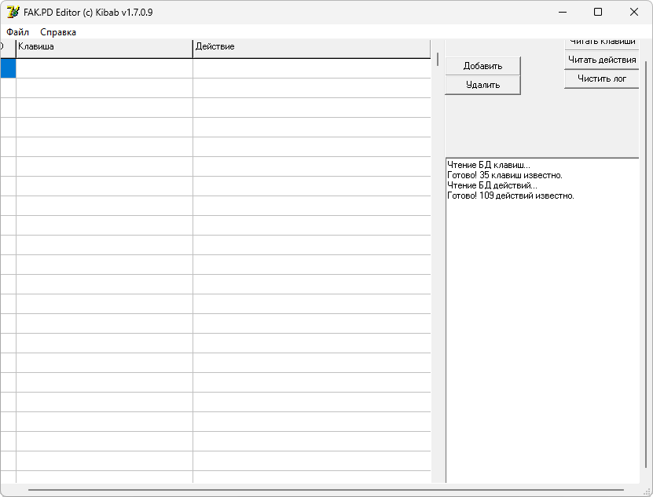

{/* Generated by tools/generateSoftware.ts. Do not edit manually. */}

# FAK Editor

**Автор:** Kibab 
**Платформы:** x65/x75 (SGOLD)

FAK Editor предназначен для назначения горячих клавиш на Siemens S75 и SL75.
Программа открывает файл `fak.pd`, показывает сопоставления клавиш и действий и
позволяет добавлять, удалять и изменять их.

Список доступных действий и клавиш хранится в редактируемых INI-файлах. Если
загрузить `frdb.pd`, в список действий добавятся установленные в телефоне
мидлеты. Неизвестные назначения и модификаторы клавиш сохраняются без изменений.

В архив входят русская и английская базы действий и руководство пользователя.

## Версии

- **1.5** — [fak-editor-1.5.zip](https://git.siepatch.dev/siepatch/soft/media/branch/main/catalog/modding/fak-editor/files/fak-editor-1.5.zip) (2006-06-30) Windows 32-bit · 264 КиБ
