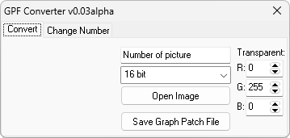

# GPF Creator

**Автор:** ziemenz 
**Платформы:** x65/x75 (SGOLD)

Программа предназначена для конвертации обычных BMP-картинок в GPF-файлы.

Поддерживаются сжатые 16- и 12-битные изображения. При конвертации задаются
номер картинки во FullFlash, цвет прозрачности и цветность. Номер картинки
можно вводить в десятичном или шестнадцатеричном виде. Программа также позволяет
открыть готовый GPF-файл и изменить записанный в нём номер картинки.

## Версии

- **0.03 alpha** — [gpf-creator-0.03-alpha.zip](https://git.siepatch.dev/siepatch/soft/media/branch/main/catalog/modding/gpf-creator/files/gpf-creator-0.03-alpha.zip) (2006-05-16) Windows 32-bit · 271 КиБ
