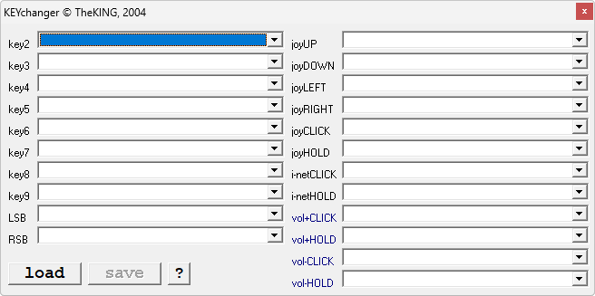

{/* Generated by tools/generateSoftware.ts. Do not edit manually. */}

# KEYchanger

**Автор:** TheKING 
**Платформы:** x65/x75 (SGOLD)

KEYchanger редактирует блоки EEPROM 5425 и 5423, сохранённые программой Siemens
EEPROM Tool. Блок 5425 отвечает за действия кнопок и джойстика в режиме ожидания,
а блок 5423 — за пункты «Моего меню».

Программа распознаёт команды запуска мидлетов, закладки и записи адресной книги,
позволяет добавлять мидлеты из `javaregdb.pd`, очищать назначения и убирать
подтверждение софт-кнопок. Названия функций загружаются из русских и английских
списков.

## Версии

- **0.07** — [keychanger-0.07.zip](https://git.siepatch.dev/siepatch/soft/media/branch/main/catalog/modding/keychanger/files/keychanger-0.07.zip) (2004-10-02) Windows 32-bit · 179 КиБ
