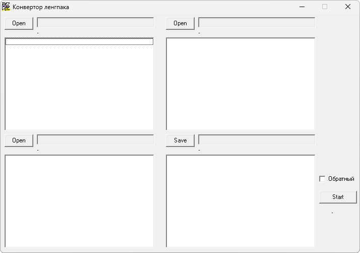

{/* Generated by tools/generateSoftware.ts. Do not edit manually. */}

# LG_R

**Автор:** Sandra 
**Платформы:** x65/x75 (SGOLD)

LG_R переносит перевод со старой версии ленгпака на новую. Программа сопоставляет
строки старого и нового английского ленгпаков, подставляет соответствующие
русские строки и отмечает фразы, для которых перевод не найден.

## Версии

- **1.0** — [lg-r-1.0.zip](https://git.siepatch.dev/siepatch/soft/media/branch/main/catalog/modding/lg-r/files/lg-r-1.0.zip) Исходный код на Delphi и текстовые выгрузки ленгпаков Siemens CX65 версий 43 и 50 Windows 32-bit · 725 КиБ
