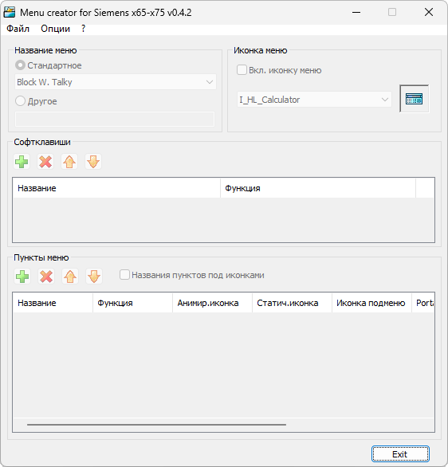

{/* Generated by tools/generateSoftware.ts. Do not edit manually. */}

# MCCx65

**Тема на форуме:** [http://forum.siemens-club.org/viewtopic.php?TopicID=40203](http://forum.siemens-club.org/viewtopic.php?TopicID=40203) 
**Платформы:** x65/x75 (SGOLD)

Menu Creator for Siemens x65–x75 предназначен для редактирования файлов меню
телефона в формате FS.

В пункты меню можно добавлять стандартные функции телефона, Java-мидлеты,
HTTP-ссылки и телефонные номера. Поддерживаются собственные названия пунктов,
их сохранение в FS- или Properties-файле и скрытие пункта, если выбранная
функция недоступна. Также поддерживаются FS-файлы меню из прошивок Vodafone.

Список функций вынесен в `mccx65.dbf`, поэтому его можно самостоятельно
дополнять. Файл для открытия можно передать программе через командную строку.

## Версии

- **0.4.2** — [mccx65-0.4.2.zip](https://git.siepatch.dev/siepatch/soft/media/branch/main/catalog/modding/mccx65/files/mccx65-0.4.2.zip) (2005-11-09) Windows 32-bit · 37.8 КиБ
