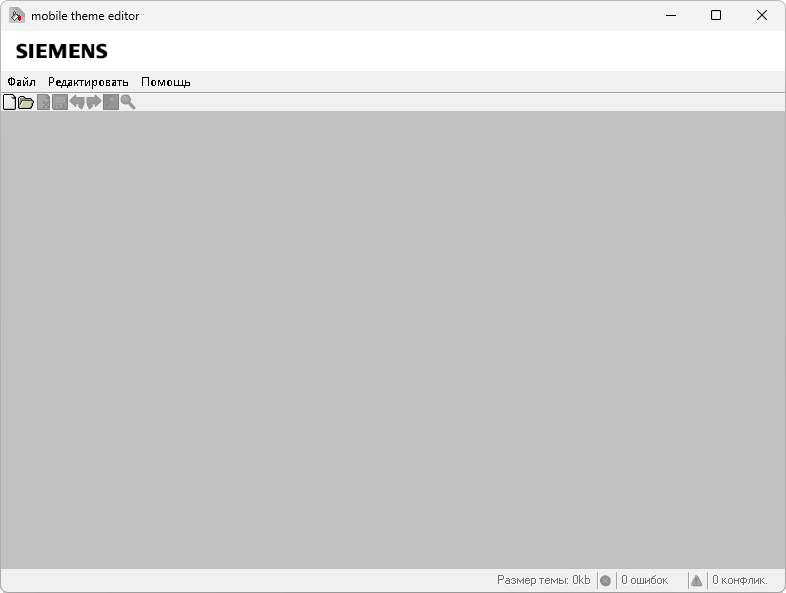

{/* Generated by tools/generateSoftware.ts. Do not edit manually. */}

# Mobile Theme Editor

**Автор:** BenQ Mobile 
**Платформы:** x65/x75 (SGOLD), BREW

Mobile Theme Editor предназначен для создания и редактирования тем оформления
телефонов BenQ-Siemens. Программа позволяет изменять графику и цветовые схемы
элементов интерфейса и просматривать результат для поддерживаемых моделей.

## Версии

- **2.2.3.053** — [mobile-theme-editor-2.2.3.053.zip](https://git.siepatch.dev/siepatch/soft/media/branch/main/catalog/modding/mobile-theme-editor/files/mobile-theme-editor-2.2.3.053.zip) (2006-09-26) Официальная английская версия Windows 32-bit · 19.9 МиБ
- **2.2.3.053** — [mobile-theme-editor-2.2.3.053-ru-1.2.2.zip](https://git.siepatch.dev/siepatch/soft/media/branch/main/catalog/modding/mobile-theme-editor/files/mobile-theme-editor-2.2.3.053-ru-1.2.2.zip) (2006-09-26) Русская локализация 1.2.2 Windows 32-bit · 11.9 МиБ
- **2.2.3.053** — [mobile-theme-editor-2.2.3.053-ru-1.1.zip](https://git.siepatch.dev/siepatch/soft/media/branch/main/catalog/modding/mobile-theme-editor/files/mobile-theme-editor-2.2.3.053-ru-1.1.zip) (2006-09-26) Русская локализация 1.1 Windows 32-bit · 11.9 МиБ
- **2.2.3.053** — [mobile-theme-editor-2.2.3.053-ru-native.zip](https://git.siepatch.dev/siepatch/soft/media/branch/main/catalog/modding/mobile-theme-editor/files/mobile-theme-editor-2.2.3.053-ru-native.zip) (2006-09-26) Русская нативная сборка Excelsior JET без указанного номера локализации Windows 32-bit · 12.0 МиБ
