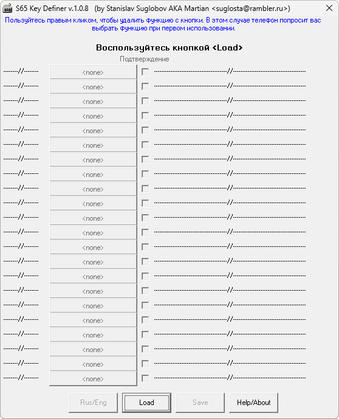

{/* Generated by tools/generateSoftware.ts. Do not edit manually. */}

# S65 Key Definer

**Автор:** Martian 
**Платформы:** x65/x75 (SGOLD)

S65 Key Definer открывает блоки EEPROM 5425 и 5423 в формате Siemens EEPROM
Tool. Блок 5425 содержит назначения клавиш, коротких и длинных нажатий джойстика;
блок 5423 — пункты «Моего меню». Выбранные функции можно заменить или удалить,
после чего сохранить блок для записи обратно в телефон.

## Версии

- **1.0.8** — [s65-key-definer-1.0.8.zip](https://git.siepatch.dev/siepatch/soft/media/branch/main/catalog/modding/s65-key-definer/files/s65-key-definer-1.0.8.zip) (2004-09-25) Windows 32-bit · 33.2 КиБ
