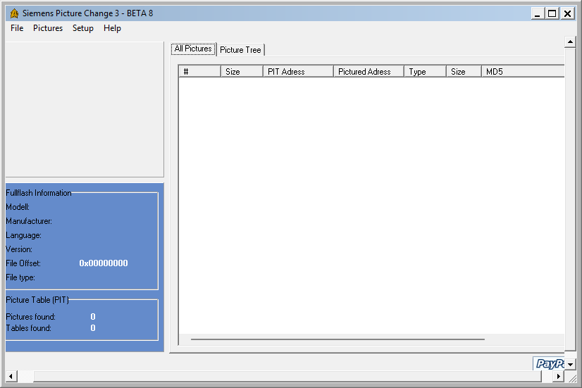

{/* Generated by tools/generateSoftware.ts. Do not edit manually. */}

# Siemens Picture Change

**Домашняя страница:** [http://gsmdev.de/index.php?c=viewprojektinfo&id=33](https://web.archive.org/web/20050313185721/http://gsmdev.de/index.php?c=viewprojektinfo&id=33) (web archive) 
**Автор:** ACiD[mrp], b@iLLi, CLuni 
**Платформы:** x35/x45/x55 (EGOLD), x65/x75 (SGOLD)

Siemens Picture Change открывает FullFlash в формате BIN, находит встроенную
графику и показывает выбранное изображение. Картинки можно извлекать в BMP,
заменять своими и сохранять изменения в виде патча V_KLay. Новое изображение
может отличаться от исходного размером; поддерживается сжатая графика тех
телефонов, где она предусмотрена прошивкой.

В SPC 2.0 есть редактор главного экрана S/ME45i: значки можно перемещать по
экрану, а изображения профилей, сети и аккумулятора — просматривать и заменять.
Поддержка моделей задаётся в INI-файле; штатно предусмотрены телефоны x35, x45 и
M(T)50.

SPC 3 переносит редактор на x65 и добавляет редактор языковых баз и плагины
обработки изображений.

## Версии

- **3.0 public beta 7** — [siemens-picture-change-3.0-beta-7.zip](https://git.siepatch.dev/siepatch/soft/media/branch/main/catalog/modding/siemens-picture-change/files/siemens-picture-change-3.0-beta-7.zip) (2005-02-14) Для x65 (SGOLD) Windows 32-bit · 1.10 МиБ

<strong>Архивные версии (3)</strong>

- **3.0 public beta** — [siemens-picture-change-3.0-beta.zip](https://git.siepatch.dev/siepatch/soft/media/branch/main/catalog/modding/siemens-picture-change/files/siemens-picture-change-3.0-beta.zip) (2004-10-15) Для x65 (SGOLD) Windows 32-bit · 1.08 МиБ
- **2.0 build 1.7.0.4** — [siemens-picture-change-2.0-setup-1.7.0.4.zip](https://git.siepatch.dev/siepatch/soft/media/branch/main/catalog/modding/siemens-picture-change/files/siemens-picture-change-2.0-setup-1.7.0.4.zip) (2004-09-01) Для x35–x55 (EGOLD) Windows 32-bit · 1.76 МиБ
- **2.0** — [siemens-picture-change-2.0.zip](https://git.siepatch.dev/siepatch/soft/media/branch/main/catalog/modding/siemens-picture-change/files/siemens-picture-change-2.0.zip) (2003-09-11) Для x35–x55 (EGOLD) Windows 32-bit · 1.15 МиБ

