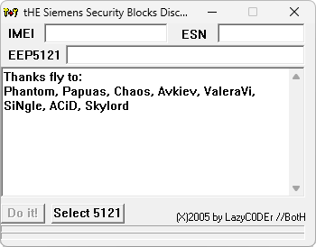

# GetMaster

**Платформы:** x65/x75 (SGOLD)

GetMaster рассчитывает мастер-код телефонов Siemens x65 по IMEI и данным
EEPROM-блока 5121.

## Версии

- **1.0** — [getmaster-1.0.zip](https://git.siepatch.dev/siepatch/soft/media/branch/main/catalog/service/getmaster/files/getmaster-1.0.zip) Windows 32-bit · 22.3 КиБ
