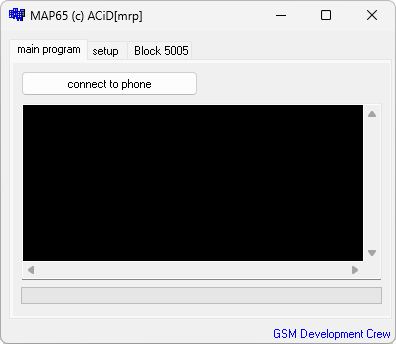

{/* Generated by tools/generateSoftware.ts. Do not edit manually. */}

# MAP65

**Автор:** ACiD[mrp] 
**Платформы:** x65/x75 (SGOLD)

MAP65 предназначен для работы со standard- и delta-MAP телефонов Siemens x65.
Программа подключается к телефону, определяет HWID и версии блоков, читает MAP в
файл и записывает выбранный MAP обратно в аппарат. Перед записью можно сохранить
исходные данные телефона.

## Версии

- **1.0** — [map65-1.0.zip](https://git.siepatch.dev/siepatch/soft/media/branch/main/catalog/service/map65/files/map65-1.0.zip) (2005-03-31) Windows 32-bit · 387 КиБ
