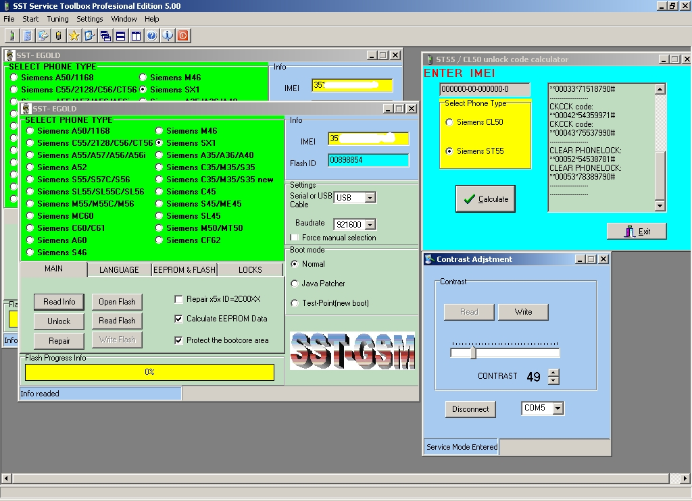

# SST Service Toolbox

**Домашняя страница:** [http://www.sst-gsm.com/](https://web.archive.org/web/20050803234139/http://www.sst-gsm.com/) (web archive) 
**Тема на форуме:** [https://forum.gsmhosting.com/vbb/f310/sst-service-toolbox-v-6-50-now-support-siemens-a70-224695/](https://forum.gsmhosting.com/vbb/f310/sst-service-toolbox-v-6-50-now-support-siemens-a70-224695/) 
**Автор:** SST-GSM Team 
**Платформы:** x35/x45/x55 (EGOLD), x65/x75 (SGOLD), ODM

SST Service Toolbox Professional Edition — профессиональная сервисная программа для телефонов Siemens.

- Разблокировка всех блокировок и кода телефона
- Повторная установка SP-Lock на выбранную сеть и добавление второго оператора
- Чтение и запись EEPROM, firmware, flash-памяти и языковых пакетов
- Восстановление не включающихся телефонов и аппаратов с сообщением Wrong Software
- Быстрая загрузка языковых пакетов и T9
- Декостомизация, резервное копирование параметров аккумулятора и настройка контраста
- Работа на скоростях до 920 кбит/с и поддержка USB-кабелей
- Защита bootcore и работа с test point
- Калькулятор кодов для CL50 и ST55
- Разблокировка, восстановление и прошивка аппаратов на EGOLD, EGOLD Lite, SGOLD, AVR и ARM

Версия 6.50 поддерживает телефоны серий x35–x65, SX1, C62, CFX65, A70 и их региональные варианты.

## Версии

- **6.50** — [sst-6.50.zip](https://git.siepatch.dev/siepatch/soft/media/branch/main/catalog/service/sst/files/sst-6.50.zip) (2005-08-07) Требуется аппаратный USB-ключ SST Windows 32-bit · 2.85 МиБ

<strong>Архивные версии (2)</strong>

- **5.32** — [sst-5.32-rtl.zip](https://git.siepatch.dev/siepatch/soft/media/branch/main/catalog/service/sst/files/sst-5.32-rtl.zip) (2005-03-20) Версия без аппаратного ключа Windows 32-bit · 1.73 МиБ
- **5.31** — [sst-5.31.zip](https://git.siepatch.dev/siepatch/soft/media/branch/main/catalog/service/sst/files/sst-5.31.zip) Требуется аппаратный ключ SST Windows 32-bit · 2.02 МиБ
- **5.31** — [sst-5.31-unprotected.zip](https://git.siepatch.dev/siepatch/soft/media/branch/main/catalog/service/sst/files/sst-5.31-unprotected.zip) Версия без аппаратного ключа Windows 32-bit · 2.18 МиБ

## Дополнительные файлы

- [sst-6.50-crack.zip](https://git.siepatch.dev/siepatch/soft/media/branch/main/catalog/service/sst/files/sst-6.50-crack.zip) Кряк для SST 6.50 Windows 32-bit · 631 КиБ
- [sst-5.31-update-fix.zip](https://git.siepatch.dev/siepatch/soft/media/branch/main/catalog/service/sst/files/sst-5.31-update-fix.zip) Исправление ошибки PC clock tampered в версии 5.31 Windows 32-bit · 28.3 КиБ
- [sst-time-patch.zip](https://git.siepatch.dev/siepatch/soft/media/branch/main/catalog/service/sst/files/sst-time-patch.zip) Патч проверки системной даты для Windows 2000/XP Windows 32-bit · 666 Б
- [sst-time-patch-98.zip](https://git.siepatch.dev/siepatch/soft/media/branch/main/catalog/service/sst/files/sst-time-patch-98.zip) Патч проверки системной даты для Windows 98 Windows 32-bit · 822 Б
