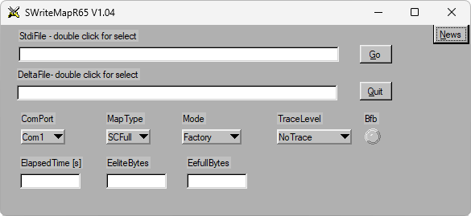

# SWriteMapR65

**Автор:** Siemens 
**Платформы:** x65/x75 (SGOLD)

Сервисная программа Siemens для записи стандартных и дельта-MAP-файлов в
EEPROM телефонов серии x75. Работает с телефоном через COM-порт в BFB Mode;
предусмотрены Factory Mode и Developer Mode.

В архив входит среда выполнения NI LabWindows/CVI, необходимая для запуска
программы.

## Версии

- **1.04** — [SWriteMapR65-1.04.zip](https://git.siepatch.dev/siepatch/soft/media/branch/main/catalog/service/swrite-map-r65/files/SWriteMapR65-1.04.zip) Windows 32-bit · 1.28 МиБ
