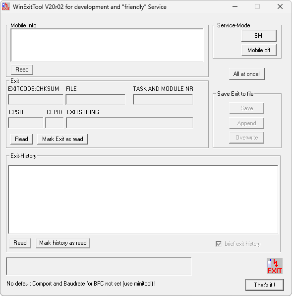

{/* Generated by tools/generateSoftware.ts. Do not edit manually. */}

# WinExitTool

**Автор:** Siemens AG 
**Платформы:** x65/x75 (SGOLD)

WinExitTool переводит телефон в ServiceMode, читает сведения об аппарате, последний EXIT-код и журнал аварийных завершений. Для записи
показываются тип и время сбоя, адрес, сигнатура, контрольная сумма, имя файла и текстовая расшифровка. Результат можно сохранить в файл,
а прочитанные записи — отметить или удалить.

Программа предназначена Siemens для разработки и сервисной диагностики телефонов 65-й серии.

## Версии

- **1.0** — [win-exit-tool-1.0.zip](https://git.siepatch.dev/siepatch/soft/media/branch/main/catalog/service/win-exit-tool/files/win-exit-tool-1.0.zip) Windows 32-bit · 321 КиБ
