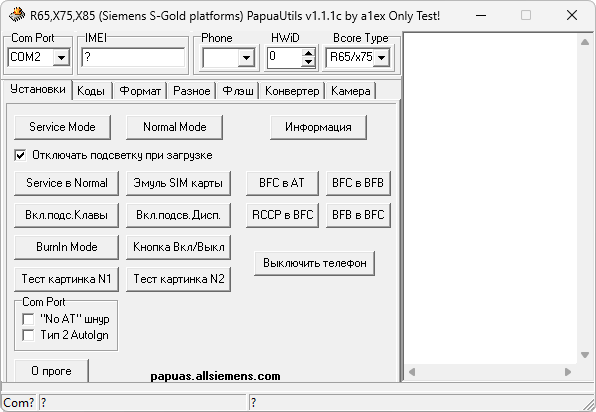

# x65PapuaUtils

**Домашняя страница:** [http://papuas.allsiemens.com/PapuaUtils.htm](https://web.archive.org/web/20130825050857/http://papuas.allsiemens.com/PapuaUtils.htm) (web archive) 
**Автор:** Papuas 
**Платформы:** x65/x75 (SGOLD)

Это программа для работы с моделями на SGOLD-платформе: S7F, S7C, S75, S66,
S6C, S6V, S65, S68, SK6C, SK6R, SK65, SL7F, SL7C, SL75, SL6C, SL6V, SL65,
SP65, M75, ME75, M6C, M6V, M65, CX75, CX7D, CX7C, CX7I, CX70, CF76, CF75,
C72V, C72, C7I, C7C, C7V, C75, C66, C6C, C6V, C65, CX66, CX6C, CX6V,
CX65…

Большинство вариантов восстановления всех софт-неисправностей x65…x75 с
помощью простого кабеля с минимальными доработками данная программа в
комплекте с V_Klay и Siemens EEPROM Tool уже содержит.

На полностью убитых телефонах первую запись BCORE производят с использованием
ТП (Тест Поинт)!

Все методы и т. д. в режиме теста. Если Вы испортите свой телефон — это Ваша
проблемка!

## Версии

- **1.1.1c** — [x65PapuaUtilsV111c_rus.zip](https://git.siepatch.dev/siepatch/soft/media/branch/main/catalog/service/x65-papua-utils/files/x65PapuaUtilsV111c_rus.zip) Русская версия. Windows 32-bit · 608 КиБ
- **1.1.1b** — [x65PapuaUtilsV111b.zip](https://git.siepatch.dev/siepatch/soft/media/branch/main/catalog/service/x65-papua-utils/files/x65PapuaUtilsV111b.zip) Английская версия. Windows 32-bit · 609 КиБ

<strong>Архивные версии (65)</strong>

- **1.0.6** — [x65PapuaUtilsV106.zip](https://git.siepatch.dev/siepatch/soft/media/branch/main/catalog/service/x65-papua-utils/files/x65PapuaUtilsV106.zip) Windows 32-bit · 603 КиБ
- **1.0.5** — [x65PapuaUtilsV105.zip](https://git.siepatch.dev/siepatch/soft/media/branch/main/catalog/service/x65-papua-utils/files/x65PapuaUtilsV105.zip) Windows 32-bit · 601 КиБ
- **1.0.4** — [x65PapuaUtilsV104.zip](https://git.siepatch.dev/siepatch/soft/media/branch/main/catalog/service/x65-papua-utils/files/x65PapuaUtilsV104.zip) Windows 32-bit · 600 КиБ
- **1.0.2** — [x65PapuaUtilsV102.zip](https://git.siepatch.dev/siepatch/soft/media/branch/main/catalog/service/x65-papua-utils/files/x65PapuaUtilsV102.zip) Windows 32-bit · 600 КиБ
- **1.0.1** — [x65PapuaUtilsV101.zip](https://git.siepatch.dev/siepatch/soft/media/branch/main/catalog/service/x65-papua-utils/files/x65PapuaUtilsV101.zip) Windows 32-bit · 587 КиБ
- **0.9.5b** — [x65PapuaUtilsV095b.zip](https://git.siepatch.dev/siepatch/soft/media/branch/main/catalog/service/x65-papua-utils/files/x65PapuaUtilsV095b.zip) Windows 32-bit · 494 КиБ
- **0.9.3** — [x65PapuaUtilsV093_rus.zip](https://git.siepatch.dev/siepatch/soft/media/branch/main/catalog/service/x65-papua-utils/files/x65PapuaUtilsV093_rus.zip) Русская версия. Windows 32-bit · 850 КиБ
- **0.9.2** — [x65PapuaUtilsV092.zip](https://git.siepatch.dev/siepatch/soft/media/branch/main/catalog/service/x65-papua-utils/files/x65PapuaUtilsV092.zip) Windows 32-bit · 714 КиБ
- **0.9.1a** — [x65PapuaUtilsV091a.zip](https://git.siepatch.dev/siepatch/soft/media/branch/main/catalog/service/x65-papua-utils/files/x65PapuaUtilsV091a.zip) Windows 32-bit · 558 КиБ
- **0.7.9g** — [x65PapuaUtilsV079g.zip](https://git.siepatch.dev/siepatch/soft/media/branch/main/catalog/service/x65-papua-utils/files/x65PapuaUtilsV079g.zip) Windows 32-bit · 591 КиБ
- **0.7.9d** — [x65PapuaUtilsV079d.zip](https://git.siepatch.dev/siepatch/soft/media/branch/main/catalog/service/x65-papua-utils/files/x65PapuaUtilsV079d.zip) (2006-04-08) Windows 32-bit · 511 КиБ
- **0.7.9c9b** — [x65PapuaUtilsV079c9b.zip](https://git.siepatch.dev/siepatch/soft/media/branch/main/catalog/service/x65-papua-utils/files/x65PapuaUtilsV079c9b.zip) Windows 32-bit · 586 КиБ
- **0.7.9c9a** — [x65PapuaUtilsV079c9a.zip](https://git.siepatch.dev/siepatch/soft/media/branch/main/catalog/service/x65-papua-utils/files/x65PapuaUtilsV079c9a.zip) Windows 32-bit · 585 КиБ
- **0.7.9c9** — [x65PapuaUtilsV079c9.zip](https://git.siepatch.dev/siepatch/soft/media/branch/main/catalog/service/x65-papua-utils/files/x65PapuaUtilsV079c9.zip) Windows 32-bit · 585 КиБ
- **0.7.9c8** — [x65PapuaUtilsV079c8.zip](https://git.siepatch.dev/siepatch/soft/media/branch/main/catalog/service/x65-papua-utils/files/x65PapuaUtilsV079c8.zip) Windows 32-bit · 585 КиБ
- **0.7.9c7** — [x65PapuaUtilsV079c7.zip](https://git.siepatch.dev/siepatch/soft/media/branch/main/catalog/service/x65-papua-utils/files/x65PapuaUtilsV079c7.zip) Windows 32-bit · 584 КиБ
- **0.7.9c6** — [x65PapuaUtilsV079c6.zip](https://git.siepatch.dev/siepatch/soft/media/branch/main/catalog/service/x65-papua-utils/files/x65PapuaUtilsV079c6.zip) Windows 32-bit · 584 КиБ
- **0.7.9c4** — [x65PapuaUtilsV079c4.zip](https://git.siepatch.dev/siepatch/soft/media/branch/main/catalog/service/x65-papua-utils/files/x65PapuaUtilsV079c4.zip) Windows 32-bit · 587 КиБ
- **0.7.9c3** — [x65PapuaUtilsV079c3.zip](https://git.siepatch.dev/siepatch/soft/media/branch/main/catalog/service/x65-papua-utils/files/x65PapuaUtilsV079c3.zip) Windows 32-bit · 679 КиБ
- **0.7.9c2** — [x65PapuaUtilsV079c2.zip](https://git.siepatch.dev/siepatch/soft/media/branch/main/catalog/service/x65-papua-utils/files/x65PapuaUtilsV079c2.zip) Windows 32-bit · 583 КиБ
- **0.7.8** — [x65PapuaUtilsV078.zip](https://git.siepatch.dev/siepatch/soft/media/branch/main/catalog/service/x65-papua-utils/files/x65PapuaUtilsV078.zip) (2006-03-16) Windows 32-bit · 435 КиБ
- **0.7.7** — [x65PapuaUtilsV077.zip](https://git.siepatch.dev/siepatch/soft/media/branch/main/catalog/service/x65-papua-utils/files/x65PapuaUtilsV077.zip) (2006-02-23) Windows 32-bit · 462 КиБ
- **0.7.6b** — [x65PapuaUtilsV076b.zip](https://git.siepatch.dev/siepatch/soft/media/branch/main/catalog/service/x65-papua-utils/files/x65PapuaUtilsV076b.zip) (2006-02-09) Windows 32-bit · 459 КиБ
- **0.7.5c** — [x65PapuaUtilsV075.zip](https://git.siepatch.dev/siepatch/soft/media/branch/main/catalog/service/x65-papua-utils/files/x65PapuaUtilsV075.zip) (2006-01-16) Windows 32-bit · 460 КиБ
- **0.7.4** — [x65PapuaUtilsV074.zip](https://git.siepatch.dev/siepatch/soft/media/branch/main/catalog/service/x65-papua-utils/files/x65PapuaUtilsV074.zip) (2005-12-31) Windows 32-bit · 459 КиБ
- **0.7.3a** — [x65PapuaUtilsV073a.zip](https://git.siepatch.dev/siepatch/soft/media/branch/main/catalog/service/x65-papua-utils/files/x65PapuaUtilsV073a.zip) Windows 32-bit · 500 КиБ
- **0.7.0** — [x65PapuaUtilsV070.zip](https://git.siepatch.dev/siepatch/soft/media/branch/main/catalog/service/x65-papua-utils/files/x65PapuaUtilsV070.zip) (2005-12-17) Windows 32-bit · 389 КиБ
- **0.6.9** — [x65PapuaUtilsV069.zip](https://git.siepatch.dev/siepatch/soft/media/branch/main/catalog/service/x65-papua-utils/files/x65PapuaUtilsV069.zip) (2005-11-26) Windows 32-bit · 392 КиБ
- **0.6.8** — [x65PapuaUtilsV068.zip](https://git.siepatch.dev/siepatch/soft/media/branch/main/catalog/service/x65-papua-utils/files/x65PapuaUtilsV068.zip) (2005-11-18) Windows 32-bit · 392 КиБ
- **0.6.7c** — [x65PapuaUtilsV067c.zip](https://git.siepatch.dev/siepatch/soft/media/branch/main/catalog/service/x65-papua-utils/files/x65PapuaUtilsV067c.zip) (2005-11-13) Windows 32-bit · 392 КиБ
- **0.6.6b** — [x65PapuaUtilsV066.zip](https://git.siepatch.dev/siepatch/soft/media/branch/main/catalog/service/x65-papua-utils/files/x65PapuaUtilsV066.zip) (2005-10-14) Windows 32-bit · 391 КиБ
- **0.6.5** — [x65PapuaUtilsV065.zip](https://git.siepatch.dev/siepatch/soft/media/branch/main/catalog/service/x65-papua-utils/files/x65PapuaUtilsV065.zip) (2005-10-11) Windows 32-bit · 391 КиБ
- **0.6.4d** — [x65PapuaUtilsV064d.zip](https://git.siepatch.dev/siepatch/soft/media/branch/main/catalog/service/x65-papua-utils/files/x65PapuaUtilsV064d.zip) Windows 32-bit · 391 КиБ
- **0.6.4** — [x65PapuaUtilsV064.zip](https://git.siepatch.dev/siepatch/soft/media/branch/main/catalog/service/x65-papua-utils/files/x65PapuaUtilsV064.zip) (2005-10-04) Windows 32-bit · 389 КиБ
- **0.6.2** — [x65PapuaUtilsV062.zip](https://git.siepatch.dev/siepatch/soft/media/branch/main/catalog/service/x65-papua-utils/files/x65PapuaUtilsV062.zip) (2005-10-02) Windows 32-bit · 388 КиБ
- **0.6.1** — [x65PapuaUtilsV061.zip](https://git.siepatch.dev/siepatch/soft/media/branch/main/catalog/service/x65-papua-utils/files/x65PapuaUtilsV061.zip) Windows 32-bit · 523 КиБ
- **0.6.0** — [x65PapuaUtilsV060.zip](https://git.siepatch.dev/siepatch/soft/media/branch/main/catalog/service/x65-papua-utils/files/x65PapuaUtilsV060.zip) (2005-09-26) Windows 32-bit · 520 КиБ
- **0.5.8** — [x65PapuaUtilsV058.zip](https://git.siepatch.dev/siepatch/soft/media/branch/main/catalog/service/x65-papua-utils/files/x65PapuaUtilsV058.zip) Windows 32-bit · 476 КиБ
- **0.5.7** — [x65PapuaUtilsV057.zip](https://git.siepatch.dev/siepatch/soft/media/branch/main/catalog/service/x65-papua-utils/files/x65PapuaUtilsV057.zip) Windows 32-bit · 476 КиБ
- **0.5.6** — [x65PapuaUtilsV056.zip](https://git.siepatch.dev/siepatch/soft/media/branch/main/catalog/service/x65-papua-utils/files/x65PapuaUtilsV056.zip) (2005-09-22) Windows 32-bit · 475 КиБ
- **0.5.5** — [x65PapuaUtilsV055.zip](https://git.siepatch.dev/siepatch/soft/media/branch/main/catalog/service/x65-papua-utils/files/x65PapuaUtilsV055.zip) (2005-09-20) Windows 32-bit · 471 КиБ
- **0.5.4** — [x65PapuaUtilsV054.zip](https://git.siepatch.dev/siepatch/soft/media/branch/main/catalog/service/x65-papua-utils/files/x65PapuaUtilsV054.zip) (2005-09-19) Windows 32-bit · 470 КиБ
- **0.5.1** — [x65PapuaUtilsV051.zip](https://git.siepatch.dev/siepatch/soft/media/branch/main/catalog/service/x65-papua-utils/files/x65PapuaUtilsV051.zip) (2005-08-26) Windows 32-bit · 324 КиБ
- **0.5.0** — [x65PapuaUtilsV050.zip](https://git.siepatch.dev/siepatch/soft/media/branch/main/catalog/service/x65-papua-utils/files/x65PapuaUtilsV050.zip) (2005-08-16) Windows 32-bit · 323 КиБ
- **0.4.9** — [x65PapuaUtilsV049.zip](https://git.siepatch.dev/siepatch/soft/media/branch/main/catalog/service/x65-papua-utils/files/x65PapuaUtilsV049.zip) В комплекте исходный код Windows 32-bit · 525 КиБ
- **0.4.8a** — [x65PapuaUtilsV048.zip](https://git.siepatch.dev/siepatch/soft/media/branch/main/catalog/service/x65-papua-utils/files/x65PapuaUtilsV048.zip) (2005-07-19) Windows 32-bit · 323 КиБ
- **0.4.7r** — [x65PapuaUtilsV047.zip](https://git.siepatch.dev/siepatch/soft/media/branch/main/catalog/service/x65-papua-utils/files/x65PapuaUtilsV047.zip) (2005-07-11) Windows 32-bit · 324 КиБ
- **0.4.7** — [x65PapuaUtilsV047-original.zip](https://git.siepatch.dev/siepatch/soft/media/branch/main/catalog/service/x65-papua-utils/files/x65PapuaUtilsV047-original.zip) Windows 32-bit · 323 КиБ
- **0.4.6** — [x65PapuaUtilsV046.zip](https://git.siepatch.dev/siepatch/soft/media/branch/main/catalog/service/x65-papua-utils/files/x65PapuaUtilsV046.zip) (2005-07-01) Windows 32-bit · 322 КиБ
- **0.4.5b** — [x65PapuaUtilsV045.zip](https://git.siepatch.dev/siepatch/soft/media/branch/main/catalog/service/x65-papua-utils/files/x65PapuaUtilsV045.zip) (2005-06-30) Windows 32-bit · 321 КиБ
- **0.4.4a** — [x65PapuaUtilsV044.zip](https://git.siepatch.dev/siepatch/soft/media/branch/main/catalog/service/x65-papua-utils/files/x65PapuaUtilsV044.zip) (2005-06-24) Windows 32-bit · 314 КиБ
- **0.4.3** — [x65PapuaUtilsV043.zip](https://git.siepatch.dev/siepatch/soft/media/branch/main/catalog/service/x65-papua-utils/files/x65PapuaUtilsV043.zip) (2005-06-19) Windows 32-bit · 314 КиБ
- **0.4.2** — [x65PapuaUtilsV042.zip](https://git.siepatch.dev/siepatch/soft/media/branch/main/catalog/service/x65-papua-utils/files/x65PapuaUtilsV042.zip) Windows 32-bit · 313 КиБ
- **0.4.1g** — [x65PapuaUtilsV041.zip](https://git.siepatch.dev/siepatch/soft/media/branch/main/catalog/service/x65-papua-utils/files/x65PapuaUtilsV041.zip) (2005-06-07) Windows 32-bit · 310 КиБ
- **0.4.0** — [x65PapuaUtilsV040.zip](https://git.siepatch.dev/siepatch/soft/media/branch/main/catalog/service/x65-papua-utils/files/x65PapuaUtilsV040.zip) Windows 32-bit · 343 КиБ
- **0.3.8d** — [x65PapuaUtilsV038.zip](https://git.siepatch.dev/siepatch/soft/media/branch/main/catalog/service/x65-papua-utils/files/x65PapuaUtilsV038.zip) (2005-06-01) Windows 32-bit · 342 КиБ
- **0.3.6** — [x65PapuaUtilsV036.zip](https://git.siepatch.dev/siepatch/soft/media/branch/main/catalog/service/x65-papua-utils/files/x65PapuaUtilsV036.zip) (2005-05-28) В комплекте FAQ Windows 32-bit · 340 КиБ
- **0.3.1** — [x65PapuaUtilsV031.zip](https://git.siepatch.dev/siepatch/soft/media/branch/main/catalog/service/x65-papua-utils/files/x65PapuaUtilsV031.zip) Windows 32-bit · 336 КиБ
- **0.2.5b** — [x65PapuaUtilsV025b.zip](https://git.siepatch.dev/siepatch/soft/media/branch/main/catalog/service/x65-papua-utils/files/x65PapuaUtilsV025b.zip) Windows 32-bit · 235 КиБ
- **0.2.5** — [x65PapuaUtilsV025.zip](https://git.siepatch.dev/siepatch/soft/media/branch/main/catalog/service/x65-papua-utils/files/x65PapuaUtilsV025.zip) Windows 32-bit · 235 КиБ
- **0.2.4a** — [x65PapuaUtilsV024a.zip](https://git.siepatch.dev/siepatch/soft/media/branch/main/catalog/service/x65-papua-utils/files/x65PapuaUtilsV024a.zip) Windows 32-bit · 217 КиБ
- **0.2.4** — [x65PapuaUtilsV024.zip](https://git.siepatch.dev/siepatch/soft/media/branch/main/catalog/service/x65-papua-utils/files/x65PapuaUtilsV024.zip) Windows 32-bit · 228 КиБ
- **0.2.1** — [x65PapuaUtilsV021.zip](https://git.siepatch.dev/siepatch/soft/media/branch/main/catalog/service/x65-papua-utils/files/x65PapuaUtilsV021.zip) Windows 32-bit · 225 КиБ
- **0.2.0** — [x65PapuaUtilsV020.zip](https://git.siepatch.dev/siepatch/soft/media/branch/main/catalog/service/x65-papua-utils/files/x65PapuaUtilsV020.zip) Windows 32-bit · 225 КиБ
- **0.1.9** — [x65PapuaUtilsV019.zip](https://git.siepatch.dev/siepatch/soft/media/branch/main/catalog/service/x65-papua-utils/files/x65PapuaUtilsV019.zip) Windows 32-bit · 214 КиБ

## Дополнительные файлы

- [SWP3.zip](https://git.siepatch.dev/siepatch/soft/media/branch/main/catalog/service/x65-papua-utils/files/SWP3.zip) Файлы SWP 4.15 и 4.14 для создания UserSwup в новых версиях программы Windows 32-bit · 289 КиБ
- [SWP2.zip](https://git.siepatch.dev/siepatch/soft/media/branch/main/catalog/service/x65-papua-utils/files/SWP2.zip) Файлы SWP 4.14 и 4.12 для создания UserSwup Windows 32-bit · 267 КиБ
- [SWPEXE.zip](https://git.siepatch.dev/siepatch/soft/media/branch/main/catalog/service/x65-papua-utils/files/SWPEXE.zip) Файл SWPEXE 4.09 для создания UserSwup в версиях ниже 0.7.4 Windows 32-bit · 137 КиБ
- [AllBugSGold.zip](https://git.siepatch.dev/siepatch/soft/media/branch/main/catalog/service/x65-papua-utils/files/AllBugSGold.zip) Интерактивная видеоинструкция по устранению программных неисправностей SGOLD Windows 32-bit · 446 КиБ
