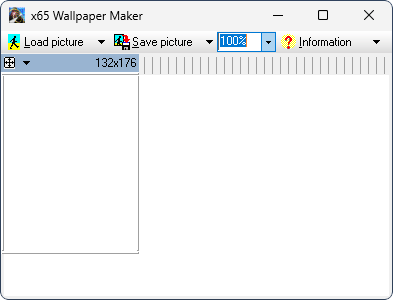

# x65 Wallpaper Maker

**Автор:** Herbert Joos 
**Платформы:** x65/x75 (SGOLD)

x65 Wallpaper Maker вырезает из большого изображения область нужного размера и
готовит обои 132×176 пикселей для телефонов Siemens x65. Поддерживаются исходные
изображения BMP, JPEG и GIF; пропорции выбранной области сохраняются при
масштабировании.

## Версии

- **1.2.2.1** — [x65-wallpaper-maker-1.2.2.1.zip](https://git.siepatch.dev/siepatch/soft/media/branch/main/catalog/utilities/x65-wallpaper-maker/files/x65-wallpaper-maker-1.2.2.1.zip) (2005-01-29) Windows 32-bit · 781 КиБ
