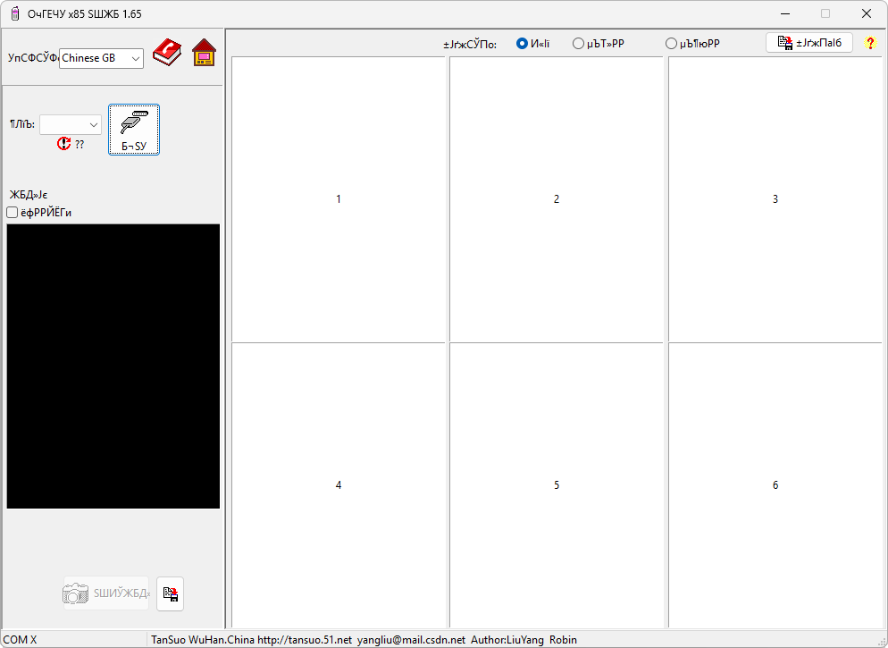

# X85Screen

**Автор:** 武汉探索电脑工作室 
**Платформы:** x65/x75 (SGOLD)

X85Screen подключается к телефону через COM-порт, считывает содержимое дисплея и
сохраняет снимок в BMP или JPEG. Полученные кадры можно разложить по шести
ячейкам, перетаскивать между ними и сохранить отдельно либо общим изображением.

## Версии

- **1.65** — [x85screen-1.65.zip](https://git.siepatch.dev/siepatch/soft/media/branch/main/catalog/utilities/x85screen/files/x85screen-1.65.zip) (2007-01-18) Windows 32-bit · 319 КиБ

<strong>Архивные версии (1)</strong>

- **0.12b** — [shootx65-0.12b.zip](https://git.siepatch.dev/siepatch/soft/media/branch/main/catalog/utilities/x85screen/files/shootx65-0.12b.zip) (2004-12-21) Ранняя версия под названием ShootX65 Windows 32-bit · 33.8 КиБ

