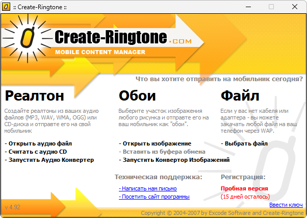

{/* Generated by tools/generateSoftware.ts. Do not edit manually. */}

# Create Ringtone

**Домашняя страница:** [http://www.create-ringtone.com/](http://www.create-ringtone.com/) 
**Автор:** Excode Software

Create Ringtone создаёт рингтоны из MP3, WAV, WMA, OGG и дорожек Audio CD,
а также подготавливает фоновые изображения для мобильных телефонов.

## Версии

- **4.92** — [create-ringtone-4.92.zip](https://git.siepatch.dev/siepatch/soft/media/branch/main/catalog/utilities/audio/create-ringtone/files/create-ringtone-4.92.zip) (2007-06-15) Релиз SnD с обходом регистрации Windows 32-bit · 1.60 МиБ
