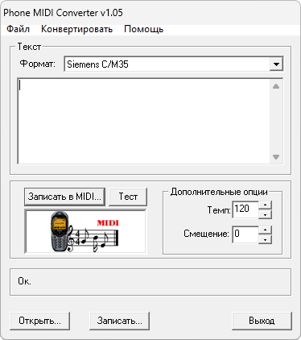

{/* Generated by tools/generateSoftware.ts. Do not edit manually. */}

# MIDIConverter

**Автор:** Michael Zolotiskiy

MIDIConverter создаёт стандартные MIDI-файлы по текстовой записи мелодии для
Siemens S/C25 и M/C/S35. Результат можно прослушать через установленный в
Windows MIDI-проигрыватель и загрузить в телефон, поддерживающий пользовательские
мелодии.

## Версии

- **1.05** — [midi-converter-1.05.zip](https://git.siepatch.dev/siepatch/soft/media/branch/main/catalog/utilities/audio/midi-converter/files/midi-converter-1.05.zip) Windows 32-bit · 87.0 КиБ
