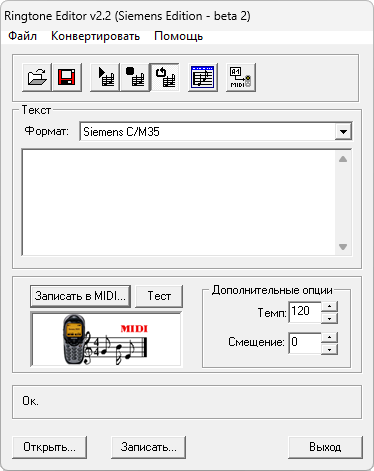

{/* Generated by tools/generateSoftware.ts. Do not edit manually. */}

# Ringtone Editor

**Автор:** Michael Zolotiskiy

Ringtone Editor предназначен для создания, редактирования и прослушивания
монофонических мелодий. Сохранённая Siemens Edition поддерживает формат Siemens
C/M35 и Nokia Standard; в архив входит оригинальная справка.

## Версии

- **2.2** — [ringtone-editor-2.2.zip](https://git.siepatch.dev/siepatch/soft/media/branch/main/catalog/utilities/audio/ringtone-editor/files/ringtone-editor-2.2.zip) Siemens Edition, beta 2 Windows 32-bit · 152 КиБ
