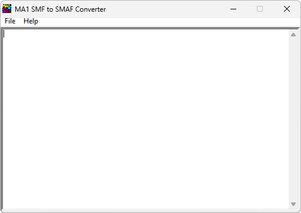

{/* Generated by tools/generateSoftware.ts. Do not edit manually. */}

# MA-1 SMF to SMAF Converter

**Автор:** Yamaha Corporation

MA-1 SMF to SMAF Converter преобразует стандартные MIDI-файлы SMF в формат
SMAF/MA-1 с расширением MMF для использования в мобильных телефонах. Программа
проверяет диапазон нот, доступный трёхоктавному синтезатору MA-1.

## Версии

- **1.2.1** — [smf-to-smaf-converter-1.2.1.zip](https://git.siepatch.dev/siepatch/soft/media/branch/main/catalog/utilities/audio/smf-to-smaf-converter/files/smf-to-smaf-converter-1.2.1.zip) Windows 32-bit · 177 КиБ
