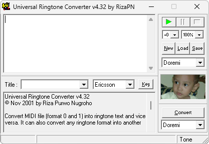

{/* Generated by tools/generateSoftware.ts. Do not edit manually. */}

# Universal Ringtone Converter

**Автор:** Riza Purwo Nugroho

Universal Ringtone Converter преобразует MIDI в текстовые форматы мелодий мобильных телефонов и обратно. Можно перевести мелодию из
одного текстового формата в другой, отредактировать её, прослушать через MIDI-секвенсор и получить последовательность клавиш для набора
на телефоне.

Описание каждого формата хранится во внешнем INI-файле и может дополняться без изменения программы. В сохранённом комплекте есть
форматы для телефонов Siemens, Nokia и Ericsson.

## Версии

- **4.32** — [universal-ringtone-converter-4.32.zip](https://git.siepatch.dev/siepatch/soft/media/branch/main/catalog/utilities/audio/universal-ringtone-converter/files/universal-ringtone-converter-4.32.zip) Windows 32-bit · 130 КиБ
